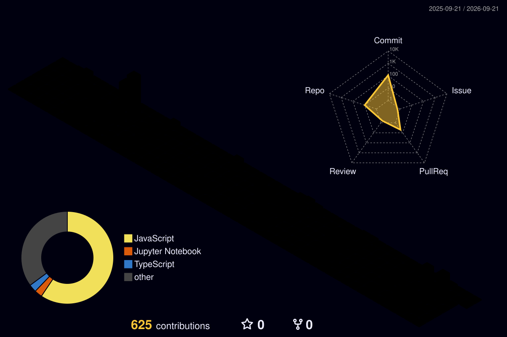

<!--
  ============================================================
  JAVED SHAH — GITHUB PROFILE README
  Software Engineer | Full-Stack Developer | Product Builder
  JavaScript | TypeScript | React.js | Next.js | Node.js
  Islamabad, Pakistan
  ============================================================
-->

<div align="center">

# 👋 Hi, I'm Javed Shah

### Software Engineer • Full-Stack Developer • Product Builder


<br/><br/>

<a href="https://javedshah.com/">
  
</a>

<a href="https://www.linkedin.com/in/javedshahdev/">
  
</a>

<a href="mailto:kingdompeople3@gmail.com">
  
</a>

<a href="https://github.com/Javedshah11">
  
</a>

<br/><br/>


</div>

---

# 👨‍💻 About Me

I'm **Javed Shah**, a **Software Engineer and Full-Stack Developer** based in **Islamabad, Pakistan**.

I build modern, scalable, secure, responsive, and production-oriented software products across the complete web application stack.

My engineering work covers:

- ⚛️ Frontend engineering with React.js and Next.js
- ⚙️ Backend development with Node.js, Express.js, and NestJS
- 💻 JavaScript and TypeScript
- 🔌 REST API design and integration
- 🔐 Authentication and authorization
- 🗄️ MongoDB and PostgreSQL applications
- ⚡ Redis and realtime systems
- 📡 WebSocket communication
- 🛒 E-commerce platforms
- 🧰 Developer tooling
- 📊 Dashboards and admin systems
- ✅ Form and backend validation
- 🧪 Testing and debugging
- 🐳 Docker and deployment workflows
- 🤖 AI-enabled software products

I enjoy transforming complex requirements into **reliable, maintainable, scalable, and useful software products**.

```typescript
const javedShah = {
  role: "Software Engineer & Full-Stack Developer",

  location: "Islamabad, Pakistan",

  primaryLanguages: [
    "JavaScript",
    "TypeScript"
  ],

  frontend: [
    "React.js",
    "Next.js",
    "Tailwind CSS",
    "Vite"
  ],

  backend: [
    "Node.js",
    "Express.js",
    "NestJS",
    "REST APIs"
  ],

  databases: [
    "MongoDB",
    "PostgreSQL",
    "Redis"
  ],

  interests: [
    "Full-Stack Engineering",
    "Backend Architecture",
    "Realtime Systems",
    "Developer Tools",
    "SaaS",
    "AI Products"
  ],

  philosophy:
    "Build useful software. Solve real problems. Keep improving."
};
```

---

# ⚡ Engineering Focus

| Area | Technologies & Focus |
|---|---|
| ⚛️ Frontend | React.js, Next.js, Tailwind CSS |
| ⚙️ Backend | Node.js, Express.js, NestJS |
| 💻 Programming | JavaScript, TypeScript |
| 🔌 APIs | REST APIs, API Integration |
| 🔐 Security | JWT, Authentication, Authorization |
| 🗄️ Databases | MongoDB, PostgreSQL, Redis |
| 📡 Realtime | WebSockets |
| 🧰 Developer Tools | Monaco Editor, xterm.js |
| 🐳 Infrastructure | Docker, Vercel |
| 🧪 Quality | Validation, Testing, Debugging |
| 🛒 Products | E-commerce, SaaS, Developer Platforms |

---

# 🛠️ Technology Stack

## 💻 Languages

<p align="center">
  
</p>

## ⚛️ Frontend

<p align="center">
  
</p>

## ⚙️ Backend

<p align="center">
  
</p>

## 🗄️ Databases

<p align="center">
  
</p>

## 🧰 Tools & Infrastructure

<p align="center">
  
</p>

---

# 🚀 Featured Projects

## 🏢 OpenHouse Connect

### AI-Powered University Open-House & Student–Company Matching Platform

**OpenHouse Connect** is a full-stack university open-house platform designed to connect students with companies, job opportunities, and recruitment workflows.

### ✨ Engineering Highlights

- 🔐 JWT authentication and authorization
- 👨‍🎓 Student accounts and dashboard
- 🏢 Company accounts and dashboard
- 🛡️ Admin workflows
- 💼 Job creation and management
- 📄 Job applications
- 🤖 AI-based CV matching
- 📊 Compatibility scoring
- 📑 PDF shortlisting
- 📧 Email verification
- 🔑 Password recovery
- 🗄️ MongoDB persistence
- 🔌 REST API integration
- 📱 Responsive interfaces

### 🛠 Technology

`React.js` `JavaScript` `Node.js` `Express.js` `MongoDB` `JWT` `Tailwind CSS` `REST APIs`

---

## 🛒 NAYRO

### Modern Production-Oriented Full-Stack E-Commerce Platform

**NAYRO** is a full-stack e-commerce platform focused on reliable customer purchasing workflows, structured administration, inventory management, checkout, order processing, and production-quality validation.

### ✨ Engineering Highlights

- 🛍️ Product management
- 📦 Inventory management
- 📢 Product publishing workflows
- 👤 Customer authentication
- 👥 Guest checkout
- 🛡️ Admin authentication
- ✅ Field-level validation
- 💳 Checkout workflows
- 📋 Order lifecycle
- 🚚 Order tracking
- 📧 Notification workflows
- 🔌 Frontend/backend integration
- 📱 Responsive customer experience
- 🖥️ Responsive admin interface
- 🧪 QA and debugging

### 🛠 Technology

`Next.js` `TypeScript` `NestJS` `Node.js` `PostgreSQL` `REST APIs`

<p>
  <a href="https://nayro.shop/">
    
  </a>
</p>

---

## 💻 Tervynix

### Developer Workspace & Runtime Platform

**Tervynix** is a developer-focused workspace platform designed around coding productivity, integrated runtime tooling, realtime communication, persistent workspace state, and modern software-development workflows.

> 🚧 **Status: Active Development**

### ✨ Engineering Highlights

- 📝 Monaco code editor
- 💻 Integrated PTY terminal
- 🖥️ Multiple terminal sessions
- ⚙️ Process management
- 🔍 Process discovery
- 🔌 Port management
- 🔎 Port discovery
- ▶️ Task discovery
- ▶️ Task execution
- 📡 WebSocket realtime communication
- 🕘 Persistent runtime history
- 🔄 Runtime event architecture
- 💾 Persistent workspace state
- ⌨️ Keyboard shortcuts
- 🎛️ Command Center
- 🔐 Runtime authentication
- 📱 Responsive developer workspace

### 🛠 Technology

`TypeScript` `React.js` `Next.js` `Node.js` `WebSockets` `Monaco Editor` `xterm.js`

---

# 🔥 GitHub Streak

<div align="center">


</div>

> The streak above is generated from GitHub contribution activity — no manually entered numbers.

---

## 🧊 Animated 3D Contribution Graph

<p align="center">
  
</p>

> Automatically generated from GitHub contribution activity.

---

# 🐍 Contribution Snake

<div align="center">

<picture>

  <source
    media="(prefers-color-scheme: dark)"
    srcset="https://raw.githubusercontent.com/Javedshah11/Javedshah11/output/github-contribution-grid-snake-dark.svg"
  />

  <source
    media="(prefers-color-scheme: light)"
    srcset="https://raw.githubusercontent.com/Javedshah11/Javedshah11/output/github-contribution-grid-snake.svg"
  />

  

</picture>

</div>

---

# 👻 Pac-Man Contribution Game

<div align="center">

<picture>

  <source
    media="(prefers-color-scheme: dark)"
    srcset="https://raw.githubusercontent.com/Javedshah11/Javedshah11/output/pacman-contribution-graph-dark.svg"
  />

  <source
    media="(prefers-color-scheme: light)"
    srcset="https://raw.githubusercontent.com/Javedshah11/Javedshah11/output/pacman-contribution-graph.svg"
  />

  

</picture>

</div>

---

# 🧱 Breakout Contribution Game

<div align="center">

<picture>

  <source
    media="(prefers-color-scheme: dark)"
    srcset="https://raw.githubusercontent.com/Javedshah11/Javedshah11/output/breakout-contribution-graph-dark.svg"
  />

  <source
    media="(prefers-color-scheme: light)"
    srcset="https://raw.githubusercontent.com/Javedshah11/Javedshah11/output/breakout-contribution-graph.svg"
  />

  

</picture>

</div>

---

# 🚀 Galaga Contribution Game

<div align="center">

<picture>

  <source
    media="(prefers-color-scheme: dark)"
    srcset="https://raw.githubusercontent.com/Javedshah11/Javedshah11/output/galaga-contribution-graph-dark.svg"
  />

  <source
    media="(prefers-color-scheme: light)"
    srcset="https://raw.githubusercontent.com/Javedshah11/Javedshah11/output/galaga-contribution-graph.svg"
  />

  

</picture>

</div>

---

<details>

<summary><b>🎮 Explore More About My Engineering Approach</b></summary>

<br/>

## 🧠 How I Approach Software Engineering

```text
Understand the problem
        ↓
Understand the requirements
        ↓
Design the architecture
        ↓
Build the core workflow
        ↓
Validate inputs
        ↓
Integrate frontend & backend
        ↓
Test real user flows
        ↓
Debug edge cases
        ↓
Improve reliability
        ↓
Ship
        ↓
Measure & improve
```

</details>

---

# 🎯 Current Engineering Focus

```yaml
primary:
  - JavaScript
  - TypeScript
  - React.js
  - Next.js
  - Node.js

backend:
  - REST API Architecture
  - Authentication
  - PostgreSQL
  - Redis
  - Realtime Systems

engineering:
  - Clean Architecture
  - Testing
  - Security
  - Performance
  - Scalability

products:
  - Full-Stack Applications
  - Developer Tools
  - SaaS Platforms
  - AI-Enabled Products
```

---

# 🧠 Engineering Journey

```text
JavaScript + TypeScript
          ↓
React.js + Next.js
          ↓
Backend Engineering
          ↓
REST APIs + Authentication
          ↓
MongoDB + PostgreSQL
          ↓
Redis + WebSockets
          ↓
Developer Tooling
          ↓
Production Architecture
          ↓
Scalable Software Products
```

---

# 💼 Professional Profile

```text
Name           : Javed Shah

Role           : Software Engineer

Specialization : Full-Stack Development

Location       : Islamabad, Pakistan

Frontend       : React.js • Next.js • Tailwind CSS

Backend        : Node.js • Express.js • NestJS

Languages      : JavaScript • TypeScript

Databases      : MongoDB • PostgreSQL • Redis

Realtime       : WebSockets

Tools          : Git • GitHub • Docker • VS Code

Interests      : SaaS • AI Products • Developer Tools
```

---

# 🌐 Connect With Me

<div align="center">

<a href="https://javed-portfolio-brown.vercel.app/">
  
</a>

<a href="https://www.linkedin.com/in/javedshahdev/">
  
</a>

<a href="https://github.com/Javedshah11">
  
</a>

<a href="mailto:kingdompeople3@gmail.com">
  
</a>

</div>

---

# 🔎 Javed Shah — Software Engineer & Full-Stack Developer

**Javed Shah** is a Software Engineer and Full-Stack Developer based in Islamabad, Pakistan, building modern web applications and software products with **JavaScript, TypeScript, React.js, Next.js, Node.js, Express.js, NestJS, MongoDB, PostgreSQL, Redis, REST APIs, WebSockets, authentication systems, e-commerce platforms, developer tools, and modern full-stack architecture**.

This GitHub profile showcases my:

- Software engineering projects
- Full-stack applications
- Frontend engineering
- Backend systems
- REST APIs
- Developer tooling
- E-commerce systems
- Realtime applications
- Technical experiments
- Product development
- Open-source work

---

<div align="center">

# 🚀 Build Useful Software. Solve Real Problems.

### Learn deeply • Engineer carefully • Ship consistently

<br/>

<a href="https://javedshah.com/">
  
</a>

<a href="https://www.linkedin.com/in/javedshahdev/">
  
</a>

<br/><br/>


<br/><br/>

### Software Engineer • Full-Stack Developer • Product Builder

</div>
